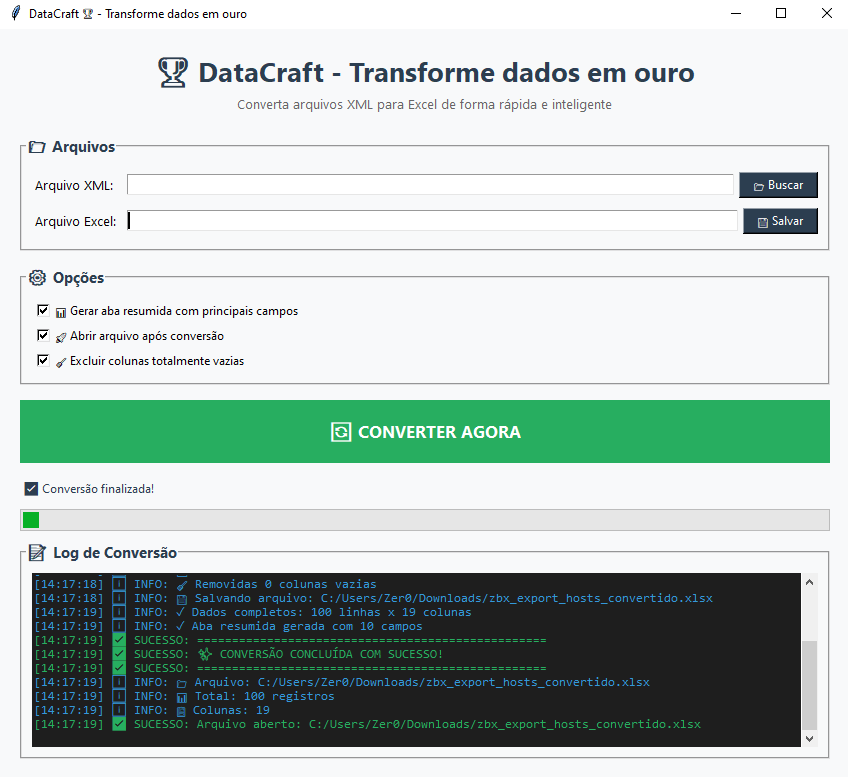

# 🏆 DataCraft - Transforme dados em ouro

[](https://github.com/Zer0G0ld/DataCraft/stargazers)
[](https://github.com/Zer0G0ld/DataCraft/network)
[](https://github.com/Zer0G0ld/DataCraft/issues)
[](https://github.com/Zer0G0ld/DataCraft/commits/main)
[](https://www.python.org/)

> **DataCraft** é uma ferramenta desktop elegante e poderosa para converter arquivos XML em planilhas Excel. Com uma interface intuitiva e processamento otimizado, você transforma dados complexos em informações valiosas em segundos!

[](https://python.org)
[](LICENSE)
[](https://github.com/Zer0G0ld/DataCraft)
[](https://microsoft.com/windows)
[](https://github.com/Zer0G0ld/DataCraft/releases)



## ✨ Características

### 🎯 Principais Funcionalidades
- **🚀 Conversão Rápida** - Processa milhares de registros em segundos
- **📊 Interface Moderna** - Design clean e intuitivo
- **📝 Log em Tempo Real** - Acompanhe cada etapa do processo
- **⚙️ Opções Personalizáveis** - Configure conforme sua necessidade
- **💾 Excel Automático** - Gera planilhas prontas para análise
- **🎨 Visual Atraente** - Cores e ícones profissionais

### 🔧 Tecnologias Utilizadas
- **Python 3.14+** - Base sólida e moderna
- **Tkinter** - Interface gráfica nativa
- **Pandas** - Processamento de dados eficiente
- **OpenPyXL** - Manipulação avançada de Excel
- **NumPy** - Computação numérica otimizada

## 📥 Instalação

### Opção 1: Download do Executável (Windows) 🪟
1. Acesse a [página de releases](https://github.com/Zer0G0ld/DataCraft/releases)
2. Baixe o arquivo `DataCraft.exe`
3. Execute diretamente - sem necessidade de instalação!

### Opção 2: Executar via Python (Multiplataforma) 🐍

```bash
# Clone o repositório
git clone https://github.com/Zer0G0ld/DataCraft.git
cd DataCraft

# Crie um ambiente virtual (recomendado)
python -m venv venv
venv\Scripts\activate  # Windows
source venv/bin/activate  # Linux/Mac

# Instale as dependências
pip install -r requirements.txt

# Execute o aplicativo
python DataCraft.py
```

## 🎮 Como Usar

### Passo a Passo

1. **Selecione o Arquivo XML**
   - Clique em "📂 Buscar"
   - Escolha seu arquivo XML

2. **Defina o Destino**
   - Clique em "💾 Salvar"
   - Escolha onde salvar a planilha Excel

3. **Configure as Opções**
   - 📊 Gerar aba resumida
   - 🚀 Abrir arquivo após conversão
   - 🧹 Excluir colunas vazias

4. **Converta!**
   - Clique em "🔄 CONVERTER AGORA"
   - Acompanhe o progresso no log
   - Pronto! Dados transformados em Excel

### 📊 Resultado Esperado

A planilha gerada contém:
- **Dados_Completos**: Todas as informações extraídas
- **Resumo**: Principais campos para análise rápida
- **Colunas Ajustadas**: Largura otimizada para visualização

## 🎯 Exemplos de Uso

### Cenário 1: Exportação do Zabbix
```xml
<zabbix_export>
    <hosts>
        <host>servidor-producao</host>
        <ip>192.168.1.100</ip>
        <tags>
            <tag>Pavimento: 3º andar</tag>
            <tag>Criticidade: Alta</tag>
        </tags>
    </hosts>
</zabbix_export>
```

**Resultado:** Planilha organizada com todos os hosts, IPs e tags!

### Cenário 2: Qualquer XML Genérico
- Extrai automaticamente todos os elementos
- Cria colunas para tags e valores
- Remove colunas vazias para limpeza

## 🛠️ Desenvolvimento

### Estrutura do Projeto
```
DataCraft/
├── DataCraft.py           # Código principal
├── DataCraft.spec         # Configuração do PyInstaller
├── requirements.txt       # Dependências Python
├── voto.ico              # Ícone do aplicativo
├── README.md             # Documentação
├── LICENSE               # Licença MIT
└── .gitignore            # Arquivos ignorados
```

### Compilando do Zero

```bash
# Instale o PyInstaller
pip install pyinstaller

# Compile o executável
pyinstaller DataCraft.spec --clean

# O executável estará em dist/DataCraft.exe
```

### Dependências
```txt
et_xmlfile==2.0.0
numpy==2.4.3
openpyxl==3.1.5
pandas==3.0.1
python-dateutil==2.9.0.post0
six==1.17.0
tzdata==2025.3
```

## 📈 Roadmap

### Versão 1.1 (Em Desenvolvimento)
- [ ] Suporte a JSON e CSV
- [ ] Filtros avançados
- [ ] Modo batch (múltiplos arquivos)
- [ ] Temas claro/escuro
- [ ] Gráficos integrados

### Versão 2.0 (Planejado)
- [ ] Exportação para múltiplos formatos
- [ ] Transformações customizadas
- [ ] API para integração
- [ ] Versão web

## 🤝 Contribuindo

Contribuições são sempre bem-vindas! 

1. **Fork o projeto**
2. **Crie sua branch** (`git checkout -b feature/AmazingFeature`)
3. **Commit suas mudanças** (`git commit -m 'Add some AmazingFeature'`)
4. **Push para a branch** (`git push origin feature/AmazingFeature`)
5. **Abra um Pull Request**

### Reportar Bugs
Encontrou um bug? Abra uma [issue](https://github.com/Zer0G0ld/DataCraft/issues) com:
- Descrição detalhada
- Passos para reproduzir
- Sistema operacional
- Screenshots (se aplicável)

## 📄 Licença

Distribuído sob a licença MIT. Veja `LICENSE` para mais informações.

## 📧 Contato

**Desenvolvedor:** Zer0G0ld
- GitHub: [@Zer0G0ld](https://github.com/Zer0G0ld)

## 🙏 Agradecimentos

- Python Community
- Pandas Team
- OpenPyXL Developers
- Todos os contribuidores

---

## ⭐ Mostre seu apoio!

Se este projeto te ajudou, dê uma ⭐ no GitHub! Isso me motiva a continuar melhorando.

**Feito com 💛 por [Zer0G0ld](https://github.com/Zer0G0ld)**

## 📝 **LICENSE (GNU3)**
[GNU3](LICENSE)
