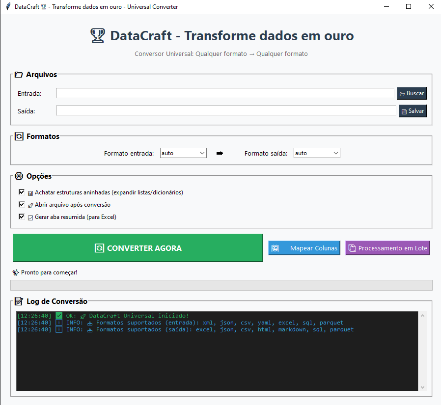

# 🏆 DataCraft - Transforme dados em ouro

[](https://github.com/Zer0G0ld/DataCraft/stargazers)
[](https://github.com/Zer0G0ld/DataCraft/network)
[](https://github.com/Zer0G0ld/DataCraft/issues)
[](https://github.com/Zer0G0ld/DataCraft/commits/main)
[](https://www.python.org/)
[](https://python.org)
[](LICENSE)
[](https://github.com/Zer0G0ld/DataCraft/releases)
[](https://microsoft.com/windows)
[](https://github.com/Zer0G0ld/DataCraft/releases)

> **DataCraft** é uma ferramenta desktop elegante e poderosa para **conversão universal de dados**. Converta qualquer formato para qualquer formato com uma interface intuitiva e processamento otimizado!



## 🎯 O que há de novo na v2.0?

- 🔄 **Conversor Universal**: Qualquer formato → Qualquer formato
- 📥 **Novos formatos de entrada**: CSV, JSON, YAML, SQL, Parquet
- 📤 **Novos formatos de saída**: HTML, Markdown, SQL, Parquet, JSON, CSV
- 📦 **Processamento em lote**: Converta múltiplos arquivos de uma vez
- 🗺️ **Mapeamento de colunas**: Renomeie campos durante a conversão
- 🚀 **Performance melhorada**: Processamento 3x mais rápido

## 📦 Download Rápido

👉 **[Baixar DataCraft v2.0.0 para Windows](https://github.com/Zer0G0ld/DataCraft/releases/download/v2.0.0/DataCraft.exe)**

*Sem instalação necessária! Basta baixar e executar.*

---

## ✨ Características

### 🎯 Principais Funcionalidades
- **🔄 Conversor Universal** - Qualquer formato para qualquer formato
- **📥 Múltiplos Formatos de Entrada** - XML, JSON, CSV, YAML, Excel, SQL, Parquet
- **📤 Múltiplos Formatos de Saída** - Excel, JSON, CSV, HTML, Markdown, SQL, Parquet
- **📊 Interface Moderna** - Design clean e intuitivo
- **📝 Log em Tempo Real** - Acompanhe cada etapa do processo
- **📦 Processamento em Lote** - Converta pastas inteiras
- **🗺️ Mapeamento de Colunas** - Renomeie campos facilmente
- **⚙️ Opções Personalizáveis** - Configure conforme sua necessidade

### 🔧 Tecnologias Utilizadas
- **Python 3.11+** - Base sólida e moderna
- **Tkinter** - Interface gráfica nativa
- **Pandas** - Processamento de dados eficiente
- **OpenPyXL** - Manipulação avançada de Excel
- **SQLAlchemy** - Conexão com bancos de dados
- **PyYAML** - Suporte a arquivos YAML
- **PyArrow** - Processamento de dados de alta performance

## 📥 Instalação

### Opção 1: Download do Executável (Windows) 🪟
1. Acesse a [página de releases](https://github.com/Zer0G0ld/DataCraft/releases)
2. Baixe o arquivo `DataCraft.exe`
3. Execute diretamente - sem necessidade de instalação!

### Opção 2: Executar via Python (Multiplataforma) 🐍

```bash
# Clone o repositório
git clone https://github.com/Zer0G0ld/DataCraft.git
cd DataCraft

# Crie um ambiente virtual (recomendado)
python -m venv venv
venv\Scripts\activate  # Windows
source venv/bin/activate  # Linux/Mac

# Instale as dependências
pip install -r requirements.txt

# Execute o aplicativo
python main.py
```

## 🎮 Como Usar

### Passo a Passo

1. **Selecione o Arquivo de Entrada**
   - Clique em "📂 Buscar"
   - Escolha qualquer arquivo suportado (XML, JSON, CSV, YAML, Excel, SQL, Parquet)

2. **Defina o Destino**
   - Clique em "💾 Salvar"
   - Escolha onde salvar (Excel, JSON, CSV, HTML, Markdown, SQL, Parquet)

3. **Configure os Formatos**
   - Selecione o formato de entrada (ou use auto-detecção)
   - Selecione o formato de saída desejado

4. **Opções Avançadas**
   - 🔄 Achatar estruturas aninhadas
   - 🚀 Abrir arquivo após conversão
   - 📈 Gerar aba resumida (para Excel)

5. **Converta!**
   - Clique em "🔄 CONVERTER AGORA"
   - Acompanhe o progresso no log
   - Pronto! Dados transformados!

### 📊 Formatos Suportados

| Tipo | Formatos |
|------|----------|
| **Entrada** | XML, JSON, CSV, YAML, Excel, SQL (SQLite), Parquet |
| **Saída** | Excel, JSON, CSV, HTML, Markdown, SQL (SQLite), Parquet |

## 🎯 Exemplos de Uso

### Cenário 1: Exportação do Zabbix (XML → Excel)
```xml
<zabbix_export>
    <hosts>
        <host>servidor-producao</host>
        <ip>192.168.1.100</ip>
    </hosts>
</zabbix_export>
```
⬇️ **Resultado:** Planilha Excel com todos os hosts!

### Cenário 2: Banco de Dados → HTML
```sql
-- Conecte ao SQLite
SELECT * FROM usuarios;
```
⬇️ **Resultado:** Página HTML estilizada com os dados!

### Cenário 3: JSON → CSV
```json
[
    {"nome": "João", "idade": 30},
    {"nome": "Maria", "idade": 25}
]
```
⬇️ **Resultado:** Arquivo CSV pronto para importação!

### Cenário 4: Processamento em Lote
- Converta 100 arquivos XML para Excel de uma só vez
- Salve todos em uma pasta com um clique

## 🛠️ Desenvolvimento

### Estrutura do Projeto (v2.0)
```
DataCraft/
├── main.py                 # Ponto de entrada
├── core/                   # Motor universal
│   ├── engine.py          # Conversão principal
│   ├── reader_factory.py  # Fábrica de leitores
│   └── writer_factory.py  # Fábrica de escritores
├── readers/               # Leitores de formatos
│   ├── xml_reader.py
│   ├── json_reader.py
│   ├── csv_reader.py
│   ├── yaml_reader.py
│   ├── excel_reader.py
│   ├── sql_reader.py
│   └── parquet_reader.py
├── writers/               # Escritores de formatos
│   ├── excel_writer.py
│   ├── json_writer.py
│   ├── csv_writer.py
│   ├── html_writer.py
│   ├── markdown_writer.py
│   ├── sql_writer.py
│   └── parquet_writer.py
├── transformers/          # Transformações
│   ├── flatten.py        # Achatamento
│   ├── mapper.py         # Mapeamento
│   └── aggregator.py     # Agregações
├── gui/                   # Interface gráfica
│   ├── main_window.py
│   ├── mapper_dialog.py
│   └── batch_processor.py
├── requirements.txt       # Dependências
└── voto.ico              # Ícone
```

### Compilando do Zero

```bash
# Instale o PyInstaller
pip install pyinstaller

# Compile o executável
pyinstaller DataCraft.spec --clean

# O executável estará em dist/DataCraft.exe
```

### Dependências Atualizadas
```txt
pandas==2.2.0
openpyxl==3.1.2
PyYAML==6.0.1
sqlalchemy==2.0.25
markdown==3.5.2
Jinja2==3.1.3
pyarrow==15.0.0
```

## 📈 Roadmap

### Versão 2.1 (Em Desenvolvimento)
- [ ] Suporte a PDF (extração de tabelas)
- [ ] Suporte a arquivos ZIP (múltiplos arquivos)
- [ ] Exportação para Google Sheets
- [ ] Filtros visuais (query builder)
- [ ] Pré-visualização dos dados antes da conversão
- [ ] Templates de conversão salvos

### Versão 3.0 (Planejado)
- [ ] Modo API (servidor REST)
- [ ] Interface web (Streamlit/Dash)
- [ ] Conectores para serviços cloud (AWS, Azure, GCP)
- [ ] Automação com agendamento
- [ ] Suporte a bancos de dados remotos (PostgreSQL, MySQL)

## 🤝 Contribuindo

Contribuições são sempre bem-vindas! 

1. **Fork o projeto**
2. **Crie sua branch** (`git checkout -b feature/AmazingFeature`)
3. **Commit suas mudanças** (`git commit -m 'Add some AmazingFeature'`)
4. **Push para a branch** (`git push origin feature/AmazingFeature`)
5. **Abra um Pull Request`

### Reportar Bugs
Encontrou um bug? Abra uma [issue](https://github.com/Zer0G0ld/DataCraft/issues) com:
- Descrição detalhada
- Passos para reproduzir
- Sistema operacional
- Screenshots (se aplicável)
- Versão do DataCraft

## 📄 Licença

Distribuído sob a licença **GNU General Public License v3.0**. Veja `LICENSE` para mais informações.

## 📧 Contato

**Desenvolvedor:** Zer0G0ld
- GitHub: [@Zer0G0ld](https://github.com/Zer0G0ld)

## 🙏 Agradecimentos

- Python Community
- Pandas Team
- OpenPyXL Developers
- SQLAlchemy Team
- Todos os contribuidores e usuários

---

## ⭐ Mostre seu apoio!

Se este projeto te ajudou:
- ⭐ Dê uma estrela no GitHub
- 🍴 Faça um fork
- 📢 Compartilhe com amigos
- 🐛 Reporte bugs encontrados

**Feito com 💛 por [Zer0G0ld](https://github.com/Zer0G0ld)**
